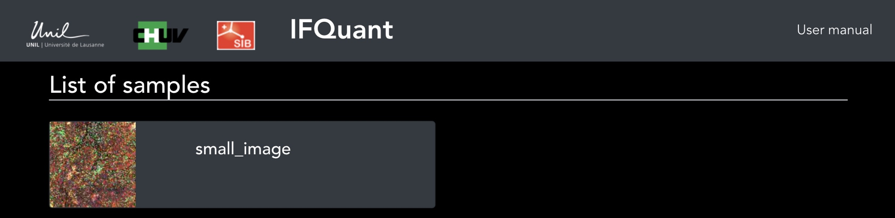
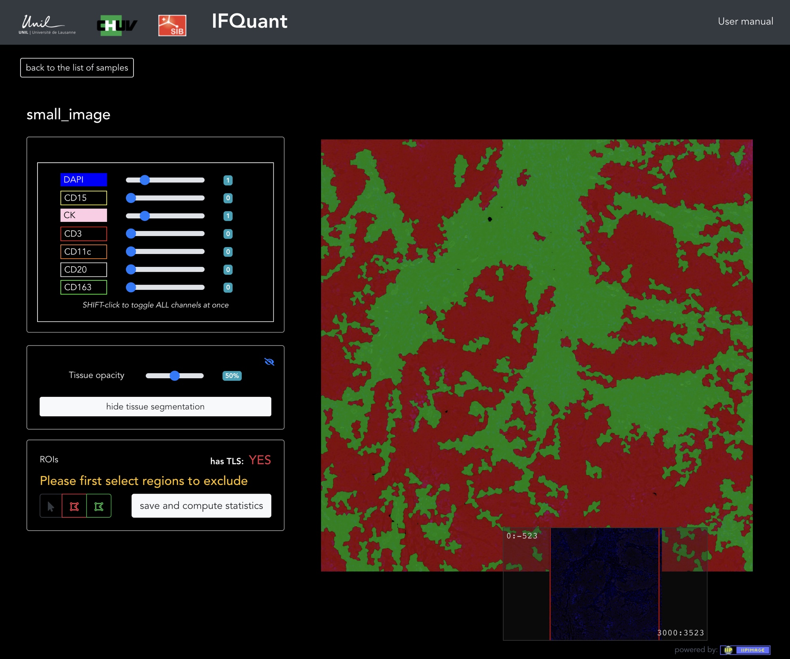
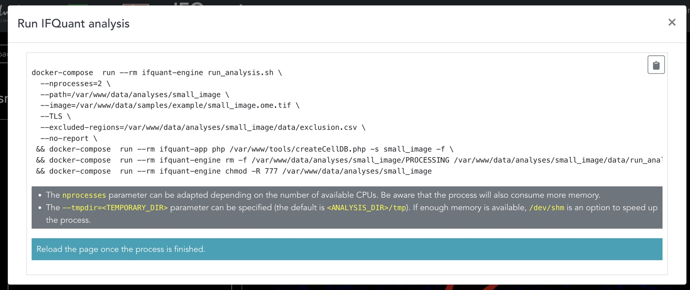
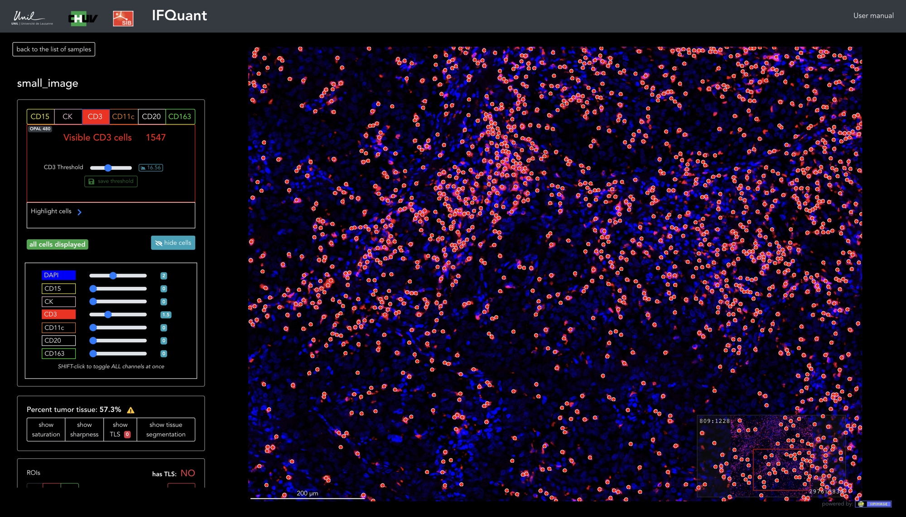
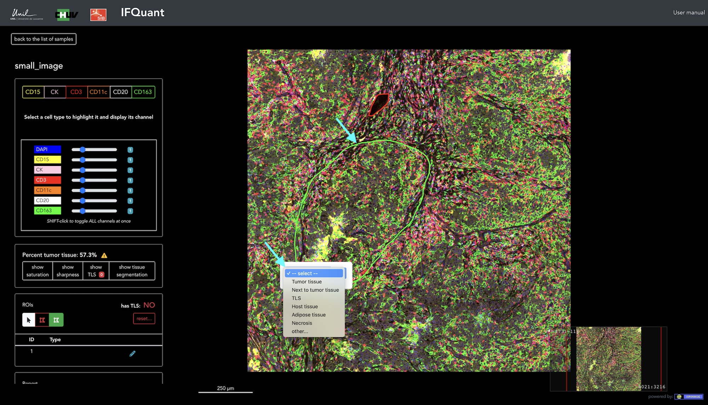
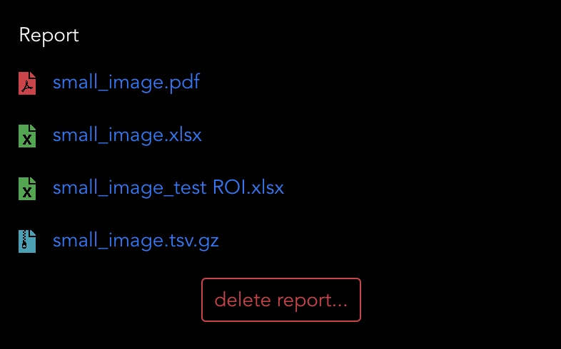

# IFQuant User Manual

There are two main directories in the `data` folder:

- **samples**: input data. Create one folder per sample. In each folder, put the image, preferentially in `.qptiff` format as well as the `panel.tsv`, `panel_thresholding.tsv`, `phenotypes.tsv`, `unmixing_parameters.csv` and `unmixing_parameters_values_distribution.csv` files. A README file describes their formats.
- **analyses**: analyzed data. (Will) contain one folder by analyzed sample. The name of each folder is identical to the corresponding directory in the `samples` folder.

## Initial image processing

If a sample exists in the `samples` directory but is absent from the  `analyses` directory, the home page ([http://localhost:8088](http://localhost:8088)) of IFQuant will display the shell command to run (Figure 1)

*Figure 1*

To process the image, open a terminal window and move to the directory containing the `docker-compose.yml` file and copy / paste the provided command.

**Note:**

- The `--nprocesses` parameter can be adapted depending on the number of available CPUs. Be aware that the process will also consume more memory.
- The `--tmpdir=<TEMPORARY_DIR>` parameter can be specified. By default, the process is creating a `tmp/` directory in the analysis directory. If enough memory is available, `/dev/shm` is an option to speed up the process.

Processing will take several minutes.

## Quality controls and excluded regions

Once the process is finished, refresh the home page ([http://localhost:8088](http://localhost:8088)). The sample will be listed in the `List of samples` (Figure 2)

*Figure 2*

Click on it to open it in IFQuant (Figure 3).

*Figure 3*

Three QC masks are available. Tissue segmentation / sharpness / saturation. By default the *tissue segmentation* mask is displayed (stroma colored in green and tumor in red). A slider enables changing the opacity of the mask, and thus display the underlying cells. To change QC mask, click on the `hitde tissue segmentation` button. 

The image might contain some background noise of regions of bad quality. These regions can be excluded by first ensuring that the red `exclusion tool` button is selected and then by drawing excluded regions on the slide (Figure 4).

*Figure 4*

Once all regions have been drawn, click on the `save and compute statistics` button. A modal window will display a shell command to paste into the terminal window (Figure 5). Ensure that you are always located in the directory containing the `docker-compose.yml` file.

*Figure 5*

**Note:**

- The `--nprocesses` parameter can be adapted depending on the number of available CPUs. Be aware that the process will also consume more memory.
- The `--tmpdir=<TEMPORARY_DIR>` parameter can be specified. By default, the process is creating a `tmp/` directory in the analysis directory. If enough memory is available, `/dev/shm` is an option to speed up the process.

## Sample analysis

Once the sample is ready for analysis, the following interface will be displayed (Figure 6)

- **A**: List of markers. Click on one to adjust its threshold (except for the tumor marker, see below)
- **B**: List of channels. By default, all channels are displayed in the composite image (F). To hide one of multiple channels, click on its name. To adjust the intensity of a channel, use its slider. Revert to its *standard* value (1) by clicking on the badge at the right of the slider.
- **C**: Show / hide the QC masks.
- **D**: Draw excluded regions or regions of interest (ROI). Once ROIs are defined, specific statistics for the ROIs will be computed in the final report.
- **E**: Report section. When a report is available, it can be downloaded from this section.
- **F**: Dynamic composite image. The image can be zoomed and paned.

*Figure 6*

### Marker intensity thresholding

IFQuant uses the notion of marker intensity thresholding to define a cell as being positive or negative for a given marker. IFQuant provides a user interface to adjust these thresholds. 

#### Tumor marker intensity thresholding

The distribution of the tumor marker signals across all cells often follows a bimodal distribution. In this case, IFQuant can suggest a usually pretty coherent threshold value. In the case where IFQuant is not confident enough to assign the default threshold, the `show tissue segmentation` button will be highlighted in red and a `check tissue segmentation` badge will be displayed. This is the case for our test sample. To adjust the tumor marker threshold, click on the `check tissue segmentation` and then on the `adjust segmentation` button. A series of tissue masks corresponding to different tumor marker thresholding values will be displayed on the right side of the screen. By clicking on the `graph` button next to the *Adjust Segmentation* title, the distribution of the tumor marker intensity signal will be displayed. In our example, we can notice that the default threshold is too low. By clicking the value 25, we can correct this value. We can play with the tissue opacity slider on the left side of the screen to verify the pertinence of the mask regarding the cells expressing the tumor marker (Figure 7). Once we are done, we can close the *adjust segmentation* interface and hide the tumor mask (Figure 6.C).

*Figure 7*

#### Other marker intensity thresholding

To adjust the intensity threshold of a given marker, first select it (Figure 6.A). By default, only the DAPI and the selected marker are displayed in the image. You can add additional cell types by selecting them (Figure 6.B). By clicking on the `show cells` button, the center of each positive cells will be spotted with a red circle (Figure 8).

*Figure 8*

Note that for performance reasons, if too many cells are positive,  only a fraction of those will be highlighted. If less the 1000 cells are visible on the image, negative cells will be spotted with a small gray circle. By clicking on the circle, the marker intensity value will be displayed (Figure 9).

*Figure 9*

IFQuant also provides a *FACS-like* interface to explore the distribution of the signal intensity of a given compared to the other markers. To display the series of scatter plots, click on the blue `plot` button at the right of the thresholding slider (Figure 10). The actual threshold is displayed as a vertical dashed line. The threshold can be adjusted in the interface by moving the green line (following the cursor) to the correct value and clicking on the mouse).

*Figure 10*

### ROI creation

If the tissue contains several regions of interest (Tumor tissue, Next to tumor tissue, TLS, Host tissue, Adipose tissue or Necrosis) that should be quantified independently, the user can *draw* these regions on the image (Figure 11). First select the **ROI** green button, then draw freely the region with the mouse and finally, select the type of ROI from the select menu.

*Figure 11*

### Create report

Once all thresholds have been reviewed and adjusted and ROI have been created (optional), a summary statistics can be computed and a PDF report generated. To do so, click on the `create report` button. Once again, a shell command will be displayed (Figure 12). Copy and paste it in a terminal window. Ensure that you are always located in the directory containing the `docker-compose.yml` file.

*Figure 12*

**Note:**

- The `--nprocesses` parameter can be adapted depending on the number of available CPUs. Be aware that the process will also consume more memory.
- The `--tmpdir=<TEMPORARY_DIR>` parameter can be specified. By default, the process is creating a `tmp/` directory in the analysis directory. If enough memory is available, `/dev/shm` is an option to speed up the process.

Once the report is ready, it can be downloaded from the `Report` section at the bottom of the left panel (Figure 13). There are at least 3 files at the end of the analysis: 

*Figure 13*

- **`sample_name`.pdf**: A full PDF report containing quality control plots and summary statistics
- **`sample_name`.xlsx**: An Excel document containing several spreadsheets with summary statistics. If ROIs have been defined, a version of this file is available for each ROI.
- **`sample_name`.tsv.gz`**: A compressed tab-delimited text file containing the processed data. Each row is a cell and columns contain cell coordinates, the tissue type of the cell (stroma/tumor), if a cell is part of an ROI, the signal intensity of each marker, the signal intensity of each marker devided by its thresholds (useful to derive marker positivity) and a phenotype key. 

**Note on the PDF report:**
*Several figures of the full sample are available in the PDF report. They are created at the scale 1:32 (one pixel in the report = 32 in the original image). It appears that this ratio is well suited to fit a whole sample in the report and to represent cell densities. For this reason, if an original image is "small" (like the provided example image), some figures in the report might show a 'pixelated' aspect.*

At this stage, the sample is on 'read-only' mode. No more threshold modifications of ROI adjustments are possible. To modify the analysis, first delete the existing report by clicking on the `delete report...` button.